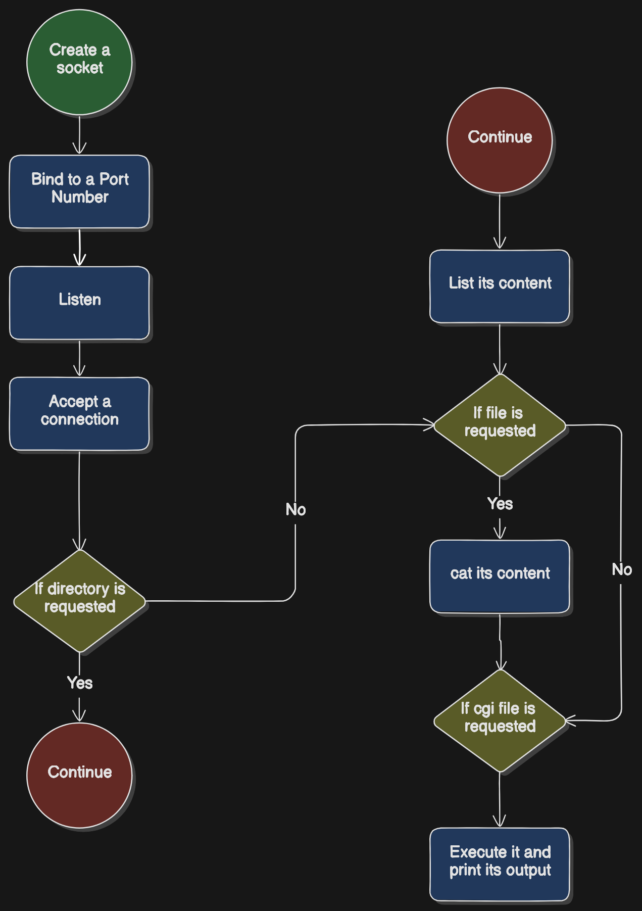

# HTTP Server Using Sockets (C)

This project demonstrates how to create a simple HTTP server in C using the socket API. The server listens for incoming HTTP requests, processes them, and sends back an HTTP response. This project is intended for educational purposes to understand how HTTP communication works at the socket level.

## Table of Contents

- [Project Overview](#project-overview)
- [Installation](#installation)
- [Usage](#usage)
- [How It Works](#how-it-works)
- [License](#license)

## Project Overview

This project creates an HTTP server by using raw sockets in C. The server listens for incoming `GET` requests, processes them, and returns a simple static HTML page as a response. This project avoids using higher-level libraries or frameworks to provide a low-level understanding of how HTTP works.

the following flowchart illustrates the application:


## Installation

1. Clone this repository:

## Compile the server:

```bash
gcc httpserver.c -o httpserver
```

## Run the server:

```bash
./httpserver 8080
```

now go to your browser and tyoe the IP address of the machine that runs the server (Or you can simply use `localhost` if you are on the same machine), followed by the port number you chose above:

```
192.168.x.x:8080/
```

This will list the content of the directory from where the server runs. if you want certain directory within it:

```
192.168.x.x:8080/directory/subdirectory/
```

If you use a file instead of directory, it will print its content:

```
192.168.x.x:8080/somefile.txt
```

If you use a cgi file, the server will execute it and prints its output to you:

```
192.168.x.x:8080/somefile.cgi
```


